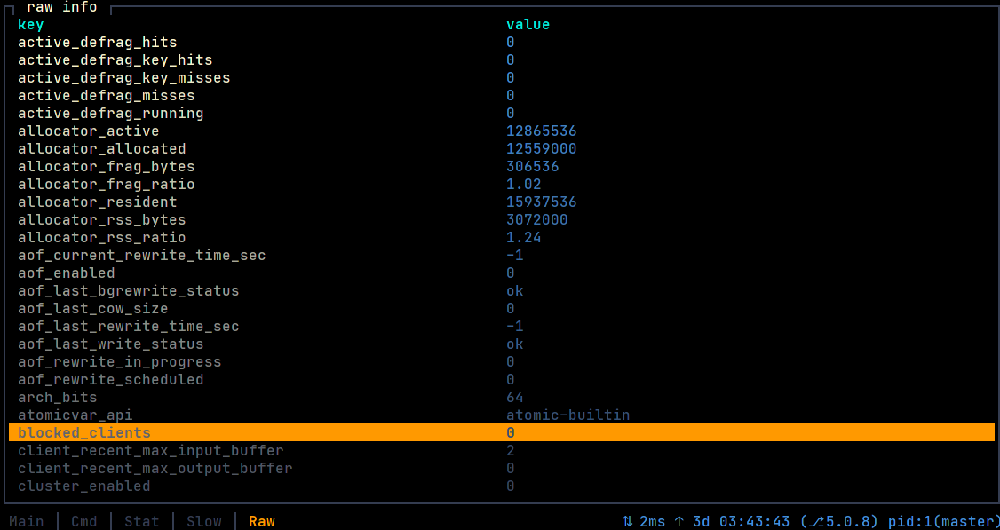
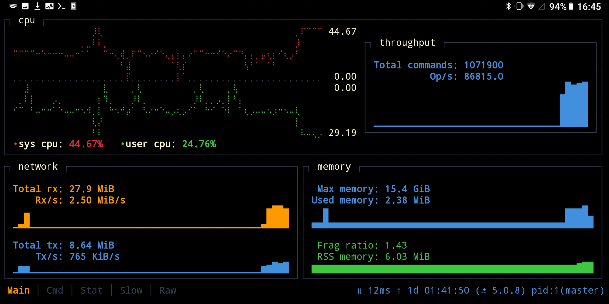

# rrtop

[r]ust [r]edis [top]

### Tool for monitoring redis server.

### Screenshots:

blackbird color scheme

one dark color scheme


### Install:

Fetch the [latest release][]

#### Install (linux x86_64)

```fish
sudo wget https://github.com/wojciech-zurek/rrtop/releases/download/v0.1.0/rrtop-x86_64-unknown-linux-gnu -O /usr/local/bin/rrtop
sudo chmod +x /usr/local/bin/rrtop
```

#### Install (linux arm64)

```fish
sudo wget https://github.com/wojciech-zurek/rrtop/releases/download/v0.1.0/rrtop-aarch64-unknown-linux-gnu -O /usr/local/bin/rrtop
sudo chmod +x /usr/local/bin/rrtop
```

#### Install (aarch64-linux-android, termux, tested on Gemini PDA)

```fish
wget https://github.com/wojciech-zurek/rrtop/releases/download/v0.1.0/rrtop-aarch64-linux-android -O $HOME/../usr/bin/rrtop
chmod +x $HOME/../usr/bin/rrtop
```

#### Install (windows x86_64)

Fetch windows version: [windows release][]

#### Clone, self-build, run (linux):

```fish
git clone git@github.com:wojciech-zurek/rrtop.git

cd rrtop

RUSTFLAGS="-C target-cpu=native" cargo build --release

sudo cp target/release/rrtop /bin/rrtop

rrtop --help

```

### Features:

rrtop is an application that allows you to monitor your redis server.

- latency,
- uptime,
- server version,
- pid,
- role,
- cpu sys utilization,
- cpu user utilization,
- op/s,
- total commands,
- network usage:
    - total rx,
    - rx/s,
    - total tx,
    - tx/s.
- memory usage:
    - max memory,
    - used memory,
    - rss memory,
    - fragmentation ratio.
- hit rate,
- total keys number,
- keys to expire,
- keys expired/s,
- evicted keys/s,
- command stats (with ratio), sort by:
    - call,
    - usec,
    - usec per call.
- slow log:
    - id,
    - time,
    - exec time,
    - command,
    - client ip/socket file,
    - client name (if set).
- raw info.

### Project status:

- alpha (more testing needed),
- ui - layout, widgets may change in the future.

### Requirements:

- rust (for self compiling/building),
- redis :),
- modern terminal (like tilix) with true colors support,
- min terminal size: 60x13 (more is better).

### Supported redis version:

- 5
- 6

Other versions not tested.

### Usage:

```fish
rrtop 0.1.0
Wojciech Żurek
[R]ust [R]edis [Top] - tool for monitoring redis server.

USAGE:
    rrtop [OPTIONS]

FLAGS:
        --help       Prints help information
    -V, --version    Prints version information

OPTIONS:
    -c <color-scheme>              Color scheme. [default: default] [possible values: blackbird, bw,
                                   default, dracula, nord, one-dark, solarized-dark]
    -t <connection-timeout>        Connection timeout in seconds [default: 5]
    -d <draw-background>           Draw background [default: true]
    -f <file-log-path>             Set file log path
    -h <host>                      Server hostname. [default: 127.0.0.1]
    -a <password>                  Password to use when connecting to the server.
    -p <port>                      Server port. [default: 6379]
    -s <socket>                    Server socket (overrides hostname and port).
    -r <tick-rate>                 Tick rate in seconds. Be careful. [default: 2.0]
    -u <username>                  User name to use when connecting to the server.
    -w <worker-number>             Worker number. Be careful. [default: 1]
```

### How to connect:

#### via tcp:

```fish
# default host and port
rrtop

# custom host and port
rrtop -h 192.168.2.2 -p 6379

# custom host, port and password
rrtop -h 192.168.2.2 -p 6379 -a 123456

# custom user and password
rrtop -u test -a 123456
```

#### via unix socket:

```
# simple usage
rrtop -s path/to/socket/file

# custom password
rrtop -s path/to/socket/file -a 123456
```

### Supported color schemes:

- blackbird.
- bw,
- default,
- dracula,
- nord,
- one-dark,
- solarized-dark

#### How to change color scheme:

```
# use -c option
rrtop -c blackbird
```

### Todo:

- fix bugs :), optimize code, clean code,
- support REDISCLI_AUTH for password auth,
- more test,
- support more metrics,
- support more themes

### Known issues:

- no windows test,
- no mac os test

### More screenshots

nord color scheme

dracula color scheme

solarized dark color scheme

raw info

android, termux


#### Some inspiration came from:

- bpytop,
- ytop,
- redis-stat

### License

MIT see [LICENSE][] for the full license text.

[LICENSE]: https://github.com/wojciech-zurek/rrtop/blob/master/LICENSE

[latest release]: https://github.com/wojciech-zurek/rrtop/releases

[windows release]: https://github.com/wojciech-zurek/rrtop/releases/download/v0.1.0/rrtop-x86_64-pc-windows-gnu.exe