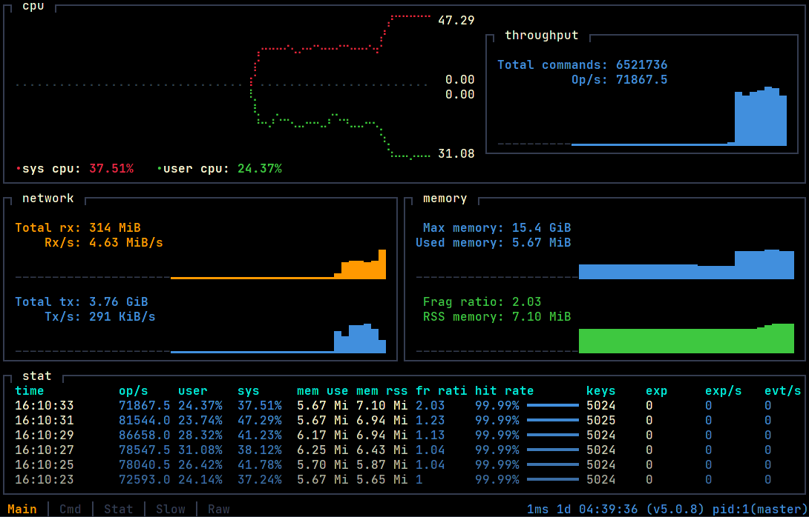
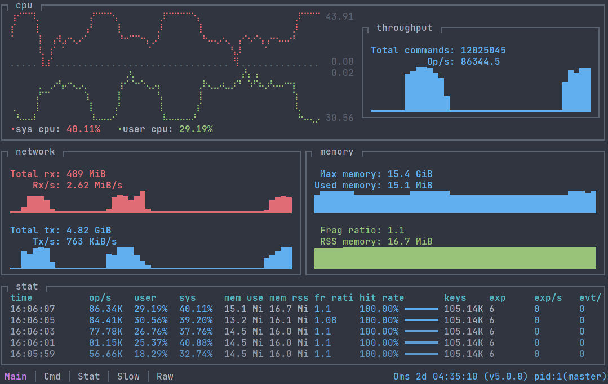
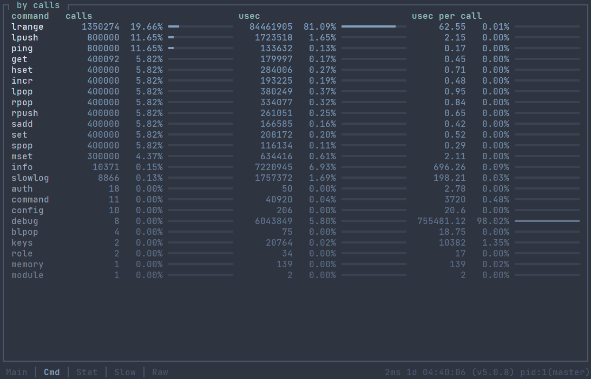
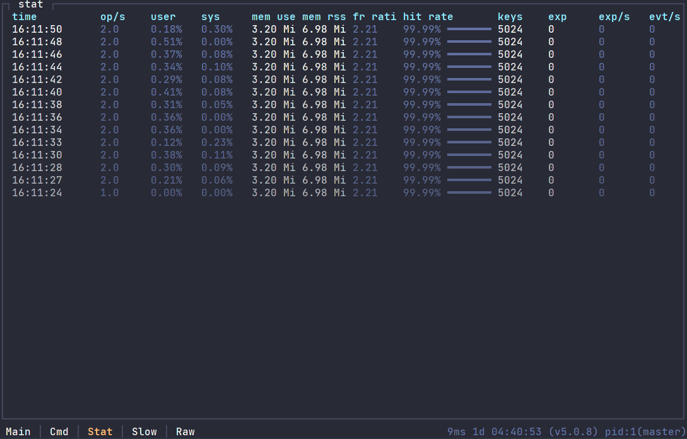
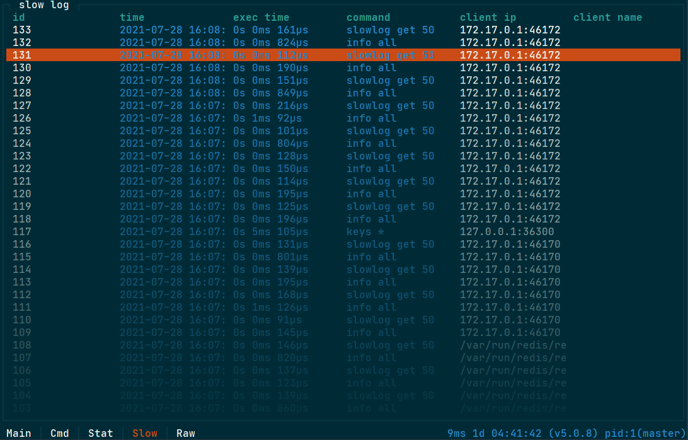

# rrtop

[r]ust [r]edis [top]

### Tool for monitoring redis server.


### Screenshots
blackbird color scheme

one dark color scheme

nord color scheme

dracula color scheme

solarized dark color scheme


### Project status:
- alpha (more testing needed)
- ui - layout, widgets may change in future

### Requirements:

- rust (for self compiling/building)
- redis :)
- modern terminal (like tilix) with true colors support
- min terminal size: 60x13 (more is better)

### Supported redis version:

- 5
- 6

Other not tested

### Usage:
```fish
rrtop 0.1.0
Wojciech Żurek
[R]ust [R]edis [Top] - tool for monitoring redis server.

USAGE:
    rrtop [OPTIONS]

FLAGS:
        --help       Prints help information
    -V, --version    Prints version information

OPTIONS:
    -c <color-scheme>              Color scheme. [default: default] [possible values: blackbird, bw,
                                   default, dracula, nord, one-dark, solarized-dark]
    -t <connection-timeout>        Connection timeout in seconds [default: 5]
    -d <draw-background>           Draw background [default: true]
    -f <file-log-path>             Set file log path
    -h <host>                      Server hostname. [default: 127.0.0.1]
    -a <password>                  Password to use when connecting to the server.
    -p <port>                      Server port. [default: 6379]
    -s <socket>                    Server socket (overrides hostname and port).
    -r <tick-rate>                 Tick rate in seconds. Be careful. [default: 2.0]
    -u <username>                  User name to use when connecting to the server.
    -w <worker-number>             Worker number. Be careful. [default: 1]
```

### How to connect:
#### via tcp:
```fish
# default host and port
rrtop

# custom host and port
rrtop -h 192.168.2.2 -p 6379

# custom host, port and password
rrtop -h 192.168.2.2 -p 6379 -a 123456
```
#### via unix socket:
```
rrtop -s path/to/socket/file
```

### Supported color schemes:
- blackbird.
- bw,
- default,
- dracula, 
- nord, 
- one-dark, 
- solarized-dark

### Clone, build, run (linux)
```fish
git clone git@github.com:wojciech-zurek/rrtop.git

cd rrtop

RUSTFLAGS="-C target-cpu=native" cargo build --release

sudo cp target/release/rrtop /bin/rrtop

rrtop --help

```

### Todo:
- fix bugs :), optimize code, clean code,
- support REDISCLI_AUTH for password auth,
- more test,
- support more metrics,
- support more themes

### Known issues:
 - no windows test,
 - no mac os test

#### Some inspiration came from:
- bpytop,
- ytop,
- redis-stat